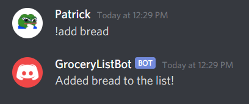
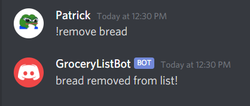
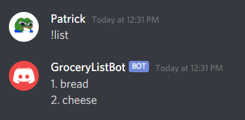
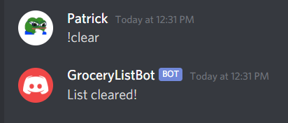

# Discord Grocery List Bot

## Adding this bot to your server
[Click here!](https://discord.com/api/oauth2/authorize?client_id=846062862685175838&permissions=2148005952&scope=bot)
## Running Source Code
1. Clone
2. Create Discord bot, add Token to .env file as ```TOKEN={token}```
3. Connect bot to server of your choice
4. Run ```py main.py```

## Commands
### Add


### Remove


### List


### Clear

